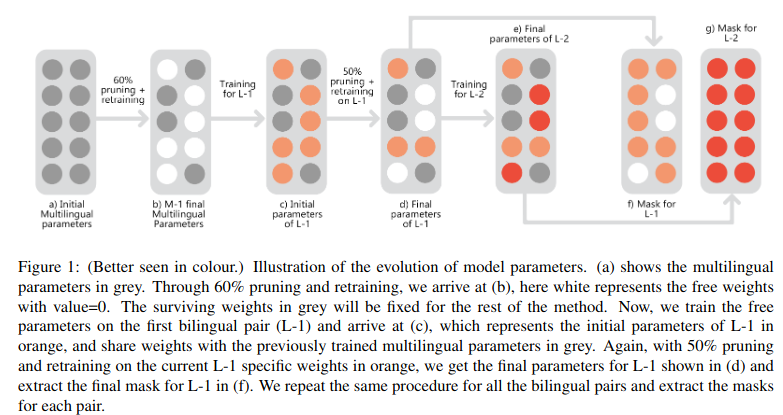

# More Parameters? No Thanks! (ACL-IJCNLP 2021 - Findings)

**[More Parameters? No Thanks!](https://aclanthology.org/2021.findings-acl.9/)**<br>
Zeeshan khan, Kartheek Akella, Vinay Namboodiri, C.V. Jawahar

We present a novel training method for Multilingual Neural Machine Translation(MNMT) to overcome negative interference and significantly boosts the performance of a taditional MNMT.



# Requirements

Python>=3.5

Pytorch>=1.0

LMDB

sentencepiece

nltk

# Download Dataset

Download the TED talks dataset for the 8 Language pairs evaluated in the paper from [Gdrive](https://drive.google.com/drive/folders/1hwZUH3IimynPz1XcDkMJxQSRT3IO_iAH?usp=sharing) 

Put all the datasets in `/data`. 

Sentencepiece models, shared vocabulary of 40k subwords, and the dictionary are present in `/shared_dicts`.


# Training

Run `bash run_pf_adapt_training.sh` to start the training. The script has multiple commands to sequentially adapt to each language pair. The first python command trains the Parent MNMT model on the multilingual dataset. Second command prunes the redundant parameters from the MNMT model and retrain for few more epochs to compensate for extreme pruning. Third command trains the free parameters on the first bilingual pair i.e. English-Arabic in the present implementation. Fourth command Prunes the redundant parameters from the ar-en specific weights only and retrain for few more epochs. 

Add more commands in `run_pf_adapt_training.sh` sequentially to adapt to more languages. 

Important arguments which decides the training variants are `--init_mnmt`, `--prune`, `--prune_perc`, `--finetune`, `--bilingual`, `--xx-en`, `--en-xx`.

For every training command `--dataset-name` and `--dataset idx` is required, following are the dataset name and index ids in the current implementation. 

1) multi - 1
2) ar - 2
3) he - 3
4) it - 4 
5) de - 5
6) sk - 6
7) gl - 7
8) az - 8
8) be - 9

Passing the  `--dataset-name` and `--dataset idx` arguments in the training command allows the dataloader to fetch the specific dataset. 

Language mask is generated in the very first step during the MNMT training. Values of the mask corresponds to the `dataset-idx`. Initially during the MNMT training, all values of the mask will be `1` reprsenting the parameters for MNMT. Sequentially for every training command, the mask gets updated with the values corresponding to the current language pair(`dataset-idx`). For every training command the checkpoint is saved in a differnt folder name based on the dataset name and index. for eg, for the MNMT training, folder `multi_1_baseline` is generated. After pruning the MNMT, checkpoints will be saved in `multi_1_final`.  After training on en-ar, checkpoints will be saved in `ar_2_finetuned`. After pruning en-ar parameters, checkpoints will be saved in `ar_2_final`. Till this moment the mask will have 3 values, `1` for the MNMT parameters, `2` for Arabic-English specific parameters and `0` for the pruned, i.e. free Parameters. Current mask is always saved with the checkpoints.

For evaluation we only use the checkpoint from the last adapted language, for this example it is `ar_2_final`, which has the parameters for both 1) Pruned MNMT and 2) arabic-english specific parameters. Applying the mask with value `1` will be equal to evaluating on the pruned-MNMT. Applying the mask with value `1 and 2` will evaluate on Arabic-English bilingual pair, and so on. 

Note : during training: in the forward pass, all the shared and specific parameters are used, i.e while training on ar-en, parameters of MNMT and ar-en both will be used. But during the backward pass only the current language specific parameters get updated(ar-en), and all the previously trained parameters are freezed. For example to evaluate on language number `4`(it-en), all the parameters for languages `1,2,3, and 4` will be used.

# Changes in the code

All the changes made in the fairseq code for adding masking and pruning modules is mainly found in `train.py, fairseq/trainer.py, fairseq/tasks/fairseq_task.py, and fairseq/checkpoint_utils.py`, with the comment `# changes made to fairseq`.

Dataset building  code is mainly found in `fairseq/data/PF-adapt/`. Code for initialising the models, dictionary, sentencepiece model and dataloaders is found in `fairseq/tasks/PF_adapt_translation.py` 

Dataset config is the `config.yaml` file and dataset registery is in `fairseq/data/PF-adapt/corpora.py`. Datasets are fetched using `fairseq/data/PF-adapt/utils`

# Evaluation

Download the pretrained model from [Gdrive](https://drive.google.com/file/d/1YognInl2gv76E2BlOux-287Cs__p0UqO/view?usp=sharing). Put the checkpoint in `/checkpoints/be_9_final/`. The checkpoint name is `final_last_be.pt`. This model is adapted for all the 8 language pairs as described in the paper. 

`eval_pf_adapt.sh` is the evaluation script. It expects 5 arguments, 1) checkpoint folder name i.e. `be_9_final`, 2) checkpoint name i.e. `final_last_be`, 3) language-name i.e. the datatset-name for eg: `de`. 4) language index i.e. dataset-idx for eg: `5`, and 5) direction i.e `en-xx, or xx-en`. 

To evaluate on German -> English, run `bash eval_pf_adapt.sh be_9_final final_last_be de 5 xx-en`
To evaluate on English -> German, run `bash eval_pf_adapt.sh be_9_final final_last_be de 5 en-xx`    


# Citation
```
@inproceedings{khan-etal-2021-parameters,
    title = "More Parameters? No Thanks!",
    author = "Khan, Zeeshan  and
      Akella, Kartheek  and
      Namboodiri, Vinay  and
      Jawahar, C V",
    booktitle = "Findings of the Association for Computational Linguistics: ACL-IJCNLP 2021",
    month = aug,
    year = "2021",
    address = "Online",
    publisher = "Association for Computational Linguistics",
    url = "https://aclanthology.org/2021.findings-acl.9",
    doi = "10.18653/v1/2021.findings-acl.9",
    pages = "96--102",
}

```


